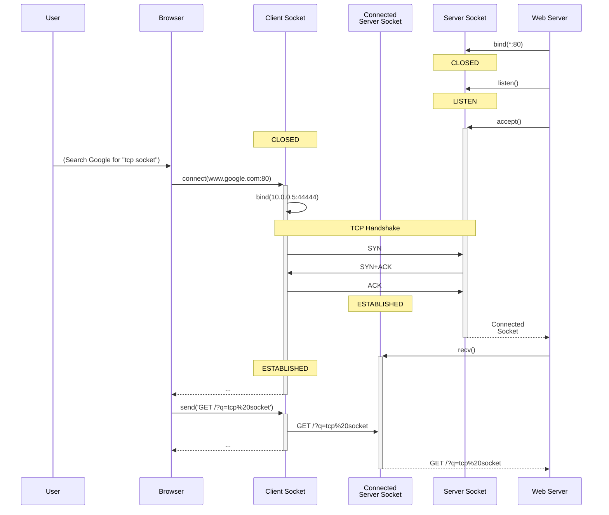

# How Does the Internet Work?

# Introduction

-   Cold War origins (ARPANET)
-   Global decentralized network
-   The Internet is made up of many **L**ocal **A**rea **N**etworks, like the ones in your home or office building, and **W**ide **A**rea **N**etworks.


## Overview

The Internet consists of 4 layers which are numbered from the bottom up:

| Layer # | Layer Name  | Protocols                                                                                                        | Related Concepts                                          |
| ------- | ----------- | ---------------------------------------------------------------------------------------------------------------- | --------------------------------------------------------- |
| 4       | Application | HTTP &bull; Every application-specific protocol, e.g. email (POP3 &bull; SMTP &bull; IMAP), WhatsApp, Netflix... | Domain Names, DNS &bull; Request/Response &bull; URL      |
| 3       | Transport   | TCP &bull; UDP                                                                                                   | Client/Server &bull; Connection &bull; Port &bull; Socket |
| 2       | Internet    | IP                                                                                                               | IP Address &bull; IPv4/IPv6                               |
| 1       | Link        | WiFi &bull; Ethernet &bull; ADSL &bull; Cellular Data (LTE, 4G, 5G...)                                           | Physical (MAC) Address                                    |

## The Link Layer

-   Allows direct communication between computers that are connected by a _physical medium_ (wire, optical fiber, radio frequency, satellite link...) to each other or to a common router.
-   LANs usually use _Ethernet_ cables and/or _WiFi_ to connect end devices to a central router.
-   End devices have a 48-bit _physical, or MAC, address_.
-   To send a message from one computer to another on the same LAN, the sender must know the recipient's physical address.


-   Pneumatic tube analogy: to send a package, you need to
    1.  Put the package in a canister.
        1.  Write the recipient's name on one side of the canister.
        1.  Write the sender's name (yours) on the other side.
    1.  Put the canister in your end of the pneumatic tube and send it to the sorting room.
    1.  A worker in the sorting room receives the canister, reads who is supposed to receive it, puts it in the proper tube and sends it to that person's room.
    1.  The recipient opens the canister and takes the package.
-   Similarly, to send digital information to another computer on the same LAN, the link layer
    1.  Constructs a _frame_, made up of
        1.  The _frame header_ (14 bytes), containing the physical addresses of the sender and the recipient.
        1.  The actual data, or _payload_.
        1.  The _frame footer_ (4 bytes).
    1.  Transmits the frame over the physical medium (wire or radio frequency) connecting your device to the router.
    1.  The router repeats the frame over the medium that connects it to the recipient.
    1.  The other computer extracts the payload from the frame and interprets it somehow.

## The Internet Layer

-   Allows communications between _any two_ computers on the Internet, not just those that are directly connected to each other.
-   Consists of one main protocol, the _Internet Protocol_ (IP) and several auxilliary protocols (e.g. ICMP).
-   IP Addresses:

    | Version | Bits | Example                             |
    | ------- | ---- | ----------------------------------- |
    | IPv4    | 32   | `10.83.237.32`                      |
    | IPv6    | 128  | `2a03:2880:f22d:c5:face:b00c:0:167` |

-   Uses other computers on the Internet as _routers_, or _gateways_ (i.e. relays) between different networks.
-   IP software is built into the operating systems of the end computers and of each intermediate router.


-   To send a message to another computer on the Internet:
    1. Construct a _packet_, made up of
        1. The _IP header_, containing the IP addresses of the sender and recipient.
        1. The actual data, or _payload_.
    1. If the destination address belongs to the local network:
        1. Translate the IP address to a physical address using the Address Resolution Protocol (ARP).
        1. Send the packet, using the link layer, directly to the destination.
    1. If the destination address does not belong to the local network:
        1. Use a _routing table_ to decide which gateway on the local network is closest to the packet's intended destination.
        1. Use the link layer to send the packet to that gateway (e.g. your DSL router).
        1. The gateway relays the packet to the other network.
        1. Each hop brings the packet closer to its destination.
-   So, an Ethernet frame contains an IP packet, which, in turn, contains the payload.


#### The Loopback Interface

-   The IP address `127.0.0.1` is special: any packet sent to this address comes back as an incoming packet without actually being transmitted to the network.
-   The name `localhost` can usually be used as an alias for this address.
-   This allows inter-process communication between processes on the same computer using the same code as for networked communication. _Extremely useful during development!_

## The Transport Layer

So, the Internet layer allows us to communicate with any computer on the Internet. Why do we need more layers, then?

<table>
    <thead>
        <tr>
            <th>&nbsp;</th>
            <th>Comm<br/>Layer</th>
            <th>Implemented by</th>
        </tr>
    </thead>
    <tbody>
        <tr>
            <td>&nbsp;</td>
            <td>Application</td>
            <td>Application</td>
        </tr>
        <tr>
            <td>&nbsp;</td>
            <td>Transport</td>
            <td rowspan="3">OS</td>
        </tr>
        <tr>
            <td>&nbsp;</td>
            <td>Internet</td>
            <!-- <td>OS</td> -->
        </tr>
        <tr>
            <td>&nbsp;</td>
            <td rowspan="2">Link</td>
            <!-- <td>OS</td> -->
        </tr>
        <tr>
            <td>&nbsp;</td>
            <!-- <td>Link</td> -->
            <td colspan="2">Hardware</td>
        </tr>
    </tbody>
</table>

#### Processes

-   Modern operating systems support _multitasking_: running more than one program at the same time.
-   A _process_ is an isolated execution environment in which the OS runs each program.
    -   You can think of a process as a kind of "bubble" that the OS inflates around the application's code and data, isolating it from the rest of the software running on the computer at the same time.
-   The process gives the application code the illusion that it the only program running on the computer.
-   If an application crashes, it doesn't crash the whole system.

#### Processes and IP Packets

-   Incoming IP packets are received by the OS.
-   However, most packets are meant to be handled by some specific application. For example, an HTTP response should go to the browser that requested it.
-   If we let each running process pick the packets it wants to handle, bad things can happen.
-   So, the OS needs a way to determine which process should get each packet.

#### Servers vs. Clients

-   To establish two-way communications between two processes, one starts first and waits for the other to connect to it.
-   The process that starts first is considered to be the _server_ and the other one the _client_.
-   After communication is established, the transport layer doesn't impose any roles on the connected parties. In particular, either side may choose to terminate the connection.
-   Possible ways to organize communications:
    -   Peer-to-peer (P2P):
        ```mermaid
        graph LR;
        P1[Peer] --- P2[Peer]
        ```
        Notable example: BitTorrent.
    -   One server concurrently serving multiple clients:
        ```mermaid
        graph TD;
        C1[Client #1] --> Server
        C2[Client #2] --> Server
        C3[Client #3] --> Server
        ```
    -   The same process can simultaneously act as a server for one kind of service and as a client for another kind. For example:
        ```mermaid
        graph LR;
        B[Browser] --> WS[Web Server] --> DB[Database Server]
        ```

#### Ports

-   A _port_ is simply a 16-bit integer (a whole number between 0 and 2<sup>16</sup> (= 65536), exclusive).
-   The transport layer adds two port numbers to each packet: one for the sender and one for the receiver. (In the purple segment in this diagram.)


-   Processes use _sockets_ to bind to specific port numbers.
-   Generally speaking, two sockets on the same computer cannot be bound to the same port number. Attempting to bind to an already bound port results in a fatal error, usually terminating the process.
-   The OS uses the receiving port in the transport header to determine which socket should receive the packet.
-   Servers listen for client connections on _well known port numbers_. For example:

    | Service              | Protocol | Default Port |
    | -------------------- | -------- | ------------ |
    | File Transfer (FTP)  | TCP      | 21, 20       |
    | Mail (SMTP)          | TCP      | 25           |
    | Mail (POP3)          | TCP      | 110          |
    | Unsecured web (HTTP) | TCP      | 80           |
    | Secure web (HTTPS)   | TCP      | 443          |
    | MySQL                | TCP      | 3306         |
    | MongoDB              | TCP      | 27017        |

-   Port numbers below 1024 are assigned by [IANA](http://iana.org).
-   The OS usually assigns to the client an unused _ephemeral_ (temporary) port in the range 49152-65535.
-   The client sends the first packet to the server using the server's well-known port and the client's ephemeral port.
-   This establishes an _association_ between the server process and the client process, defined by five parameters:
    1.  The server's IP address
    2.  The client's IP address
    3.  The protocol (e.g. TCP or UDP)
    4.  The server's port number
    5.  The client's port number

#### UDP (User Datagram Protocol)

-   UDP is a very simple protocol that mainly adds the two port numbers (sender and recipient) to the underlying IP packet and not much else.
-   UDP is useful for real-time applications like live video and audio and multiplayer games.

#### TCP (Transmission Control Protocol)

-   Much more sophisticated than UDP.
-   Allows application code to view the data as a continuous stream of bytes (actually two streams: one in each direction).
-   Connection-based, like a telephone call.
-   Doesn't limit message size.
-   Used as the transport layer for HTTP.

#### Comparison of UDP and TCP

|                  | UDP                 | TCP                                                     |
| ---------------- | ------------------- | ------------------------------------------------------- |
| **Metaphore**    | Mail correspondence | Telephone call                                          |
| **Data Model**   | Discrete datagrams  | Continuous byte stream                                  |
| **Connection**   | Connectionless      | Connection-based                                        |
| **Reliability**  | Unreliable          | Reliable                                                |
| **Packet Order** | Not guaranteed      | Guaranteed to be the same order in which they were sent |
| **Delivery**     | Immediate           | May be delayed due to retransmission                    |

#### Sockets

-   _Sockets_ (originally called _"Berkley sockets"_) are OS objects that can be used by application code to communicate with local (via loopback) or remote processes using the Internet Protocol suite.
-   In other words, sockets are an _application programming interface_ (API) between the application and the transport layer.
-   You can think of a socket as a physical socket in the wall of the bubble that represents the process.
-   A socket can be in one of several states, among them are
    -   `CLOSED`
    -   `LISTEN`
    -   `ESTABLISHED`

#### TCP Socket Life Cycle

-   The server creates a socket and _binds_ it to the well-known port number.
-   The server puts the socket in the `LISTEN` state (this is sometimes referred to as a "passive open") and starts waiting for a client to connect.
-   The client creates its own socket and tells it to connect to the server using the server's well-known IP address and port number.
-   When the TCP connection is established, instead of changing the state of the socket from `LISTEN` to `ESTABLISHED`, the OS automatically creates a new socket in the `ESTABLISHED` state and binds it to all five connection parameters: the protocol (TCP), the server's own IP address, the client's IP address, the server's port and the client's port.
-   Usually the server spawns a new process to handle communication on the connected socket.
-   The original socket stays in the `LISTEN` state and can accept a connection from another client.



### Case Study: FTP

#### FTP Demonstration
