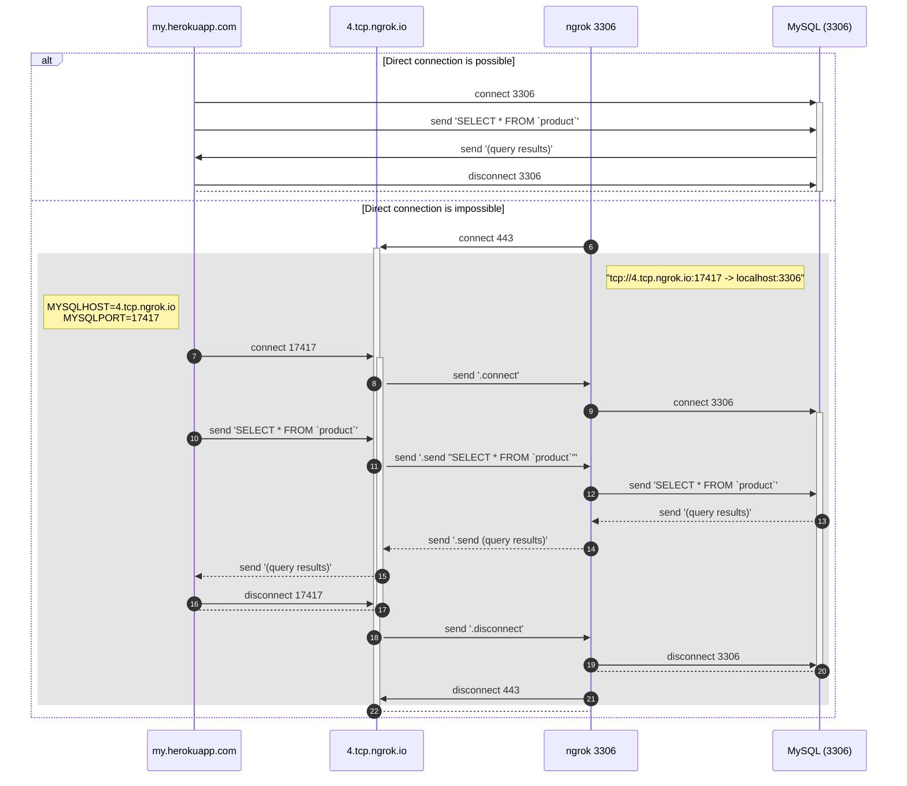

```mermaid
sequenceDiagram
participant heroku as my.herokuapp.com
participant ngrokio as 4.tcp.ngrok.io
participant ngrok as ngrok 3306
participant mysql as MySQL (3306)
alt Direct connection is possible
heroku->>+mysql: connect 3306
heroku->>mysql: send 'SELECT * FROM `product`'
mysql->>heroku: send '(query results)'
heroku->>mysql: disconnect 3306
mysql-->-heroku: 
else Direct connection is impossible
autonumber
ngrok->>+ngrokio: connect 443
rect rgba(0, 0, 0, 0.1)
Note right of ngrok: "tcp://4.tcp.ngrok.io:17417 -> localhost:3306"
Note left of heroku: MYSQLHOST=4.tcp.ngrok.io <br/> MYSQLPORT=17417
heroku->>+ngrokio: connect 17417
ngrokio->>ngrok: send '.connect'
ngrok->>+mysql: connect 3306
heroku->>ngrokio: send 'SELECT * FROM `product`'
ngrokio->>ngrok: send '.send "SELECT * FROM `product`"'
ngrok->>mysql: send 'SELECT * FROM `product`'
mysql-->>ngrok: send '(query results)'
ngrok-->>ngrokio: send '.send (query results)'
ngrokio-->>heroku: send '(query results)'
heroku->>ngrokio: disconnect 17417
ngrokio-->-heroku: 
ngrokio->>ngrok: send '.disconnect'
ngrok->>mysql: disconnect 3306
mysql-->-ngrok: 
ngrok->>ngrokio: disconnect 443
end
ngrokio-->-ngrok: 
end
```
