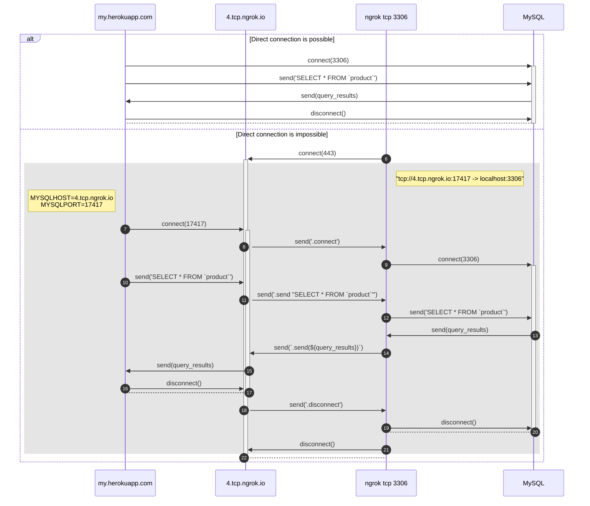

```mermaid
sequenceDiagram
participant heroku as my.herokuapp.com
participant ngrokio as 4.tcp.ngrok.io
participant ngrok as ngrok tcp 3306
participant mysql as MySQL
alt Direct connection is possible
heroku->>+mysql: connect(3306)
heroku->>mysql: send('SELECT * FROM `product`')
mysql->>heroku: send(query_results)
heroku->>mysql: disconnect()
mysql-->-heroku: 
else Direct connection is impossible
autonumber
ngrok->>+ngrokio: connect(443)
rect rgba(0, 0, 0, 0.1)
Note right of ngrok: "tcp://4.tcp.ngrok.io:17417 -> localhost:3306"
Note left of heroku: MYSQLHOST=4.tcp.ngrok.io <br/> MYSQLPORT=17417
heroku->>+ngrokio: connect(17417)
ngrokio->>ngrok: send('.connect')
ngrok->>+mysql: connect(3306)
heroku->>ngrokio: send('SELECT * FROM `product`')
ngrokio->>ngrok: send('.send "SELECT * FROM `product`"')
ngrok->>mysql: send('SELECT * FROM `product`')
mysql->>ngrok: send(query_results)
ngrok->>ngrokio: send(`.send(${query_results})`)
ngrokio->>heroku: send(query_results)
heroku->>ngrokio: disconnect()
ngrokio-->-heroku: 
ngrokio->>ngrok: send('.disconnect')
ngrok->>mysql: disconnect()
mysql-->-ngrok: 
ngrok->>ngrokio: disconnect()
end
ngrokio-->-ngrok: 
end
```
